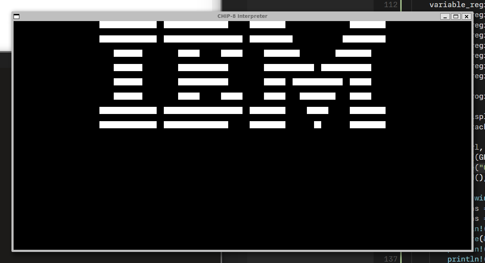

# CHIP-8 Interpreter

We implement a simple CHIP-8 interpreter following
<https://tobiasvl.github.io/blog/write-a-chip-8-emulator/>.



## Specifications

CHIP-8 has:

- Memory: direct access up to 4KiB RAM
- Display: 64x32 pixels monochrome
- Program Counter (`PC`): points at current instruction in memory
- 1x 16-bit Index Register (`I`): points at memory locations
- Stack for 16-bit addresses
- 1x 8-bit Delay Timer: decremented at 60 Hz until it reaches 0
- 1x 8-bit Sound Timer: beeps as long as non-zero
- 16x 8-bit General Purpose Variable Registers `V0` through `VF`
    - `VF` is also used as a Flag Register.

## Memory

The memory is 4KiB. The Index Register and PC can only address 12-bits, i.e. 4096 addresses. All
memory considered writable. Initial CHIP-8 loads CHIP-8 programs after 0x200.

## Font

CHIP-8 interpreter requires a built-in font for hex numbers, each character being 4x5 pixels.

## Display

The display is 64x32 pixels. Each pixel is monochrome on/off. Original interpreters redraw display
at 60 Hz but we only need to redraw whenever the interpreter executes an instruction that
modifies display data.

## Timers

CHIP-8 has two timer registers: (1) the delay timer, and (2) the sound timer. Each timer is one
byte in size and as long as their value is above 0, they should be decremented at 60 Hz. This
should be independent of the fetch-decode-execute loop.

## Keypad

The COSMAC VIP keyboard has the layout which everyone implements:

```
1	2	3	C
4	5	6	D
7	8	9	E
A	0	B	F
```

for CHIP-8 emulators on PCs, use the left side of the QWERTY keyboard for this:

```
1	2	3	4
Q	W	E	R
A	S	D	F
Z	X	C	V
```

## Fetch-Decode-Execute Loop

An emulator runs in a infinite loop and does three tasks in succession:

1. **Fetch** instruction from memory at current PC.
2. **Decode** instruction to find out what emulator should do.
3. **Execute** instruction.

### Timing

Running it at full host processor speed is too fast for CHIP-8 games. Various CHIP-8 computers
have different clock speeds, so ideally make this configurable since different games might
expect to run at different speeds.

A standard speed around 700 CHIP-8 instructions per second should be generally suitable.

### Fetch

Each instruction is 2 bytes. Once read, PC <- PC + 2.

### Decode

CHIP-8 instructions are divided into categories by first nibble (half-byte).

- `X`: second nibble. Used to look up variable registers `VX`.
- `Y`: third nibble. Used to lookup variable registers `VX`.
- `N`: fourth nibble. 4-bit number.
- `NN`: second byte. 8-bit immediate.
- `NNN`: second to fourth nibbles. 12-bit immediate.
